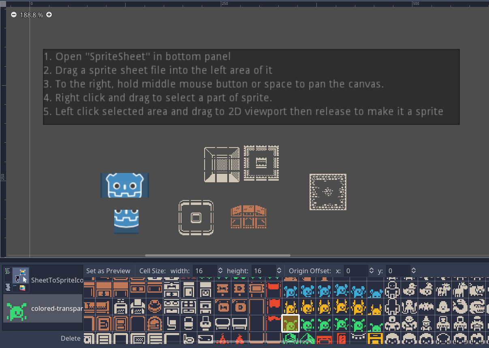
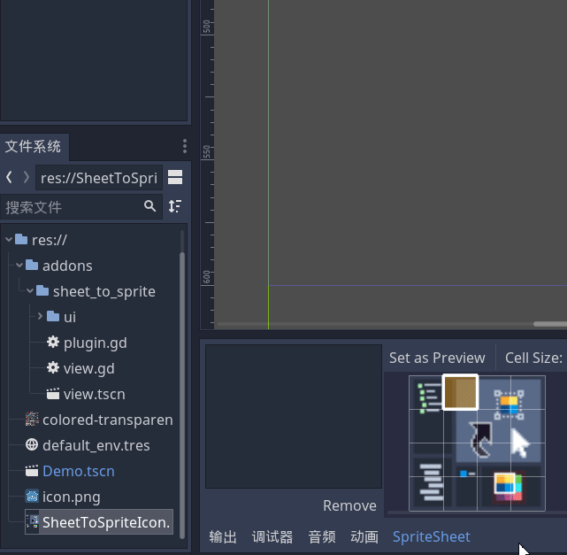
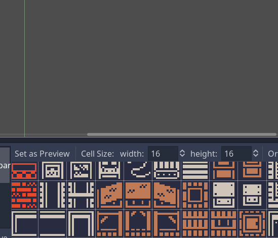

# Sheet to Sprite
A godot addon that helps you conveniently add sprite from spritesheet to a scene.

Just a simple godot plugin that helps you add decorations or objects to a scene from a spritesheet.

Originally you have to cut a spritesheet into multiple small sprite files to be quickly dragged into the scene, or you will have to enable region, then select intended part, then darg another one into the scene and repeat every step, which is kind of annoying.

With this plugin, you can easily create multiple sprites without redundant process. Just open it from bottom panel drag a sprite sheet file onto left area (as in the first gif below), **hold RMB to select** the region you want, then **drag it out with LMB** into the 2d viewport to make it a sprite (as in the second gif below). Don't forget you can **panning with holding middle mouse button**! 

> Hold right mouse button to select  
> Hold left mouse button to drag  
> Hold middle mouse button to panning  

